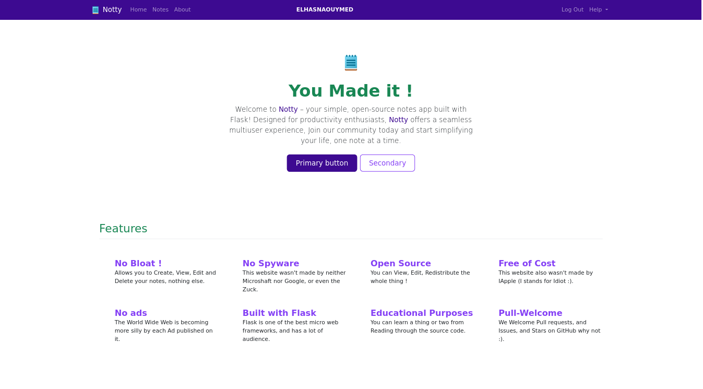
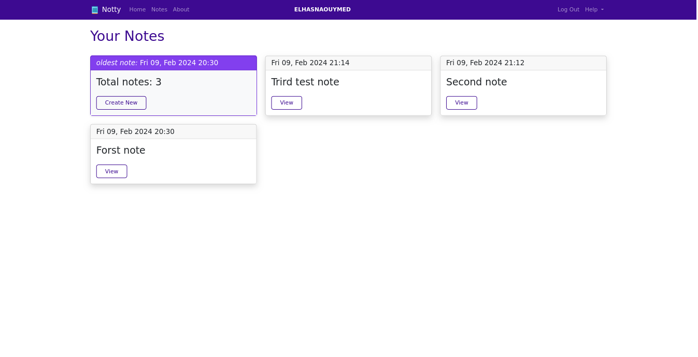
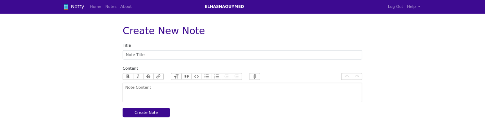
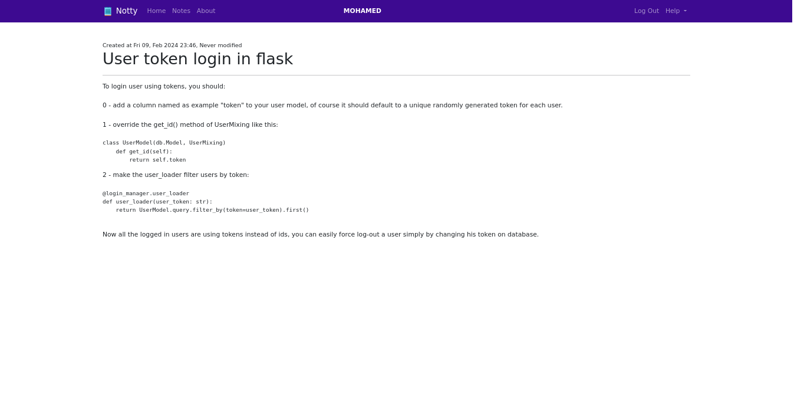

> This app is not yet completed !

# Notty

Simple Notes web app, for educational purposes.

- Has a REST API built using [flask-restx](`https://github.com/python-restx/flask-restx`).
- Has a Front-End build using [Bootstrap](https://getbootstrap.com/).
- Has a [WYSIWYG](https://itsfoss.com/open-source-wysiwyg-editors/) feature *(Nice Formatting of Notes)*.
- Very Readable/Commented code.
- Not Licensed ! Free to use and Redistribute.


## How to run

Install the requirements and then run using `python` or `python3`

```shell
python app.py
```

## Screenshots

### the Main page



### the Notes page



### the Create Note page



### the View Note page

